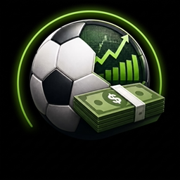
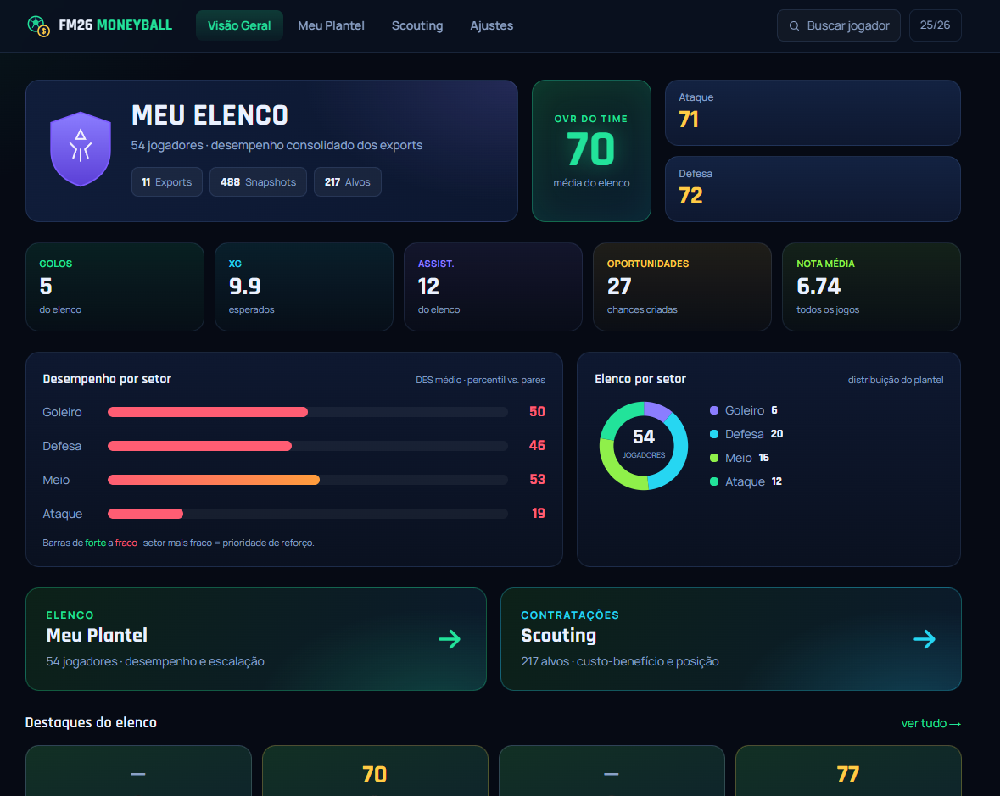
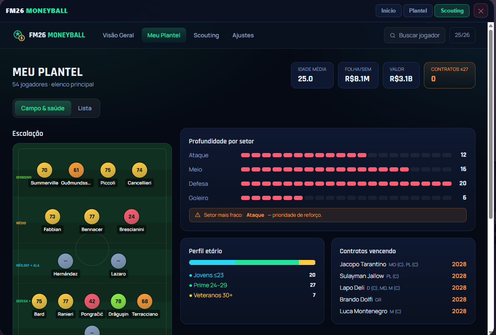
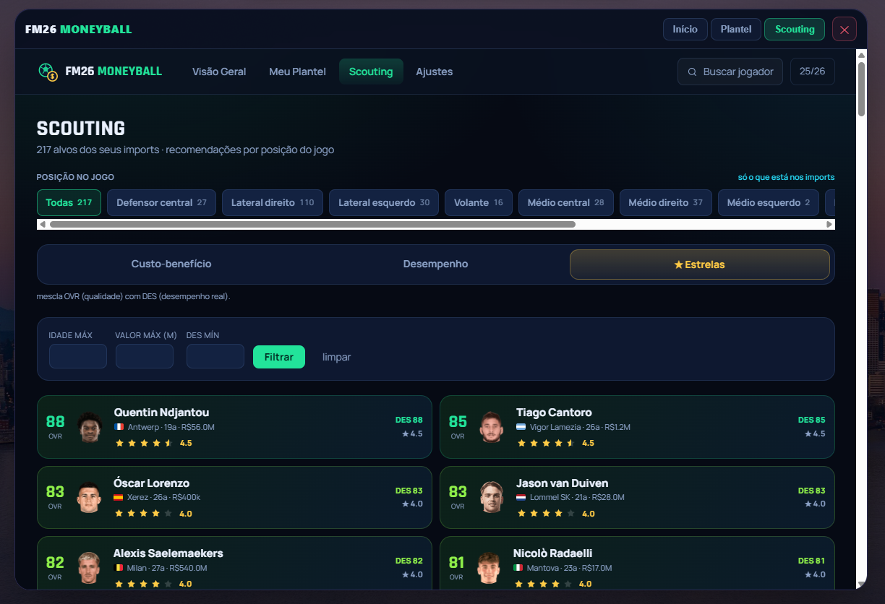
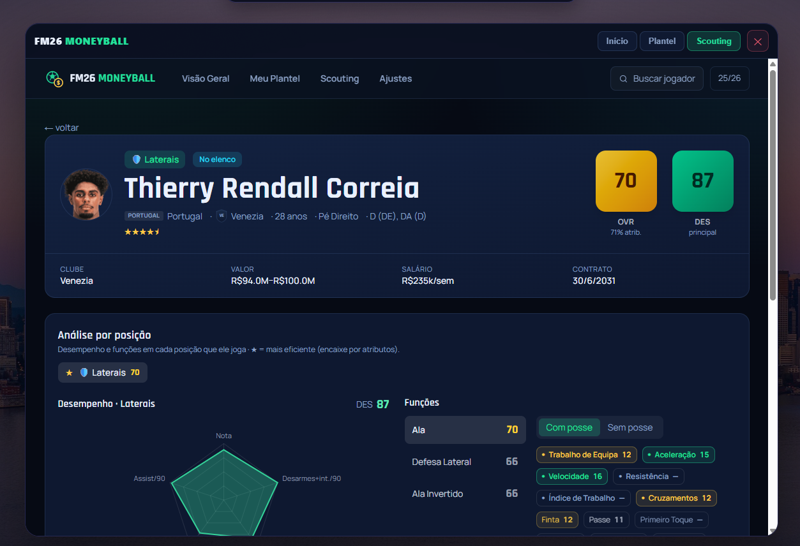
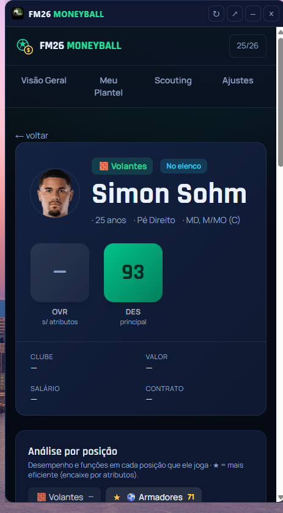
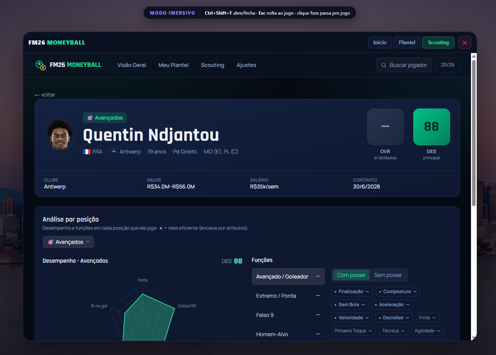

# ⚽ FM26 Moneyball

### Seu segundo monitor inteligente para o Football Manager 2026

Chega de planilha manual. Dê **`F9`** no jogo e tenha na hora um painel visual com
rankings por posição, radares de atributos, análise por setor e a metodologia
**Moneyball** aplicada ao seu elenco — tudo rodando **100% no seu PC**, sem login e
sem nuvem.

 

---

## 📸 Veja por dentro

<table>
  <tr>
    <td width="50%" valign="top">
       
      <b>Visão Geral</b> — OVR do time, gols/xG/assistências, desempenho e distribuição por setor.
    </td>
    <td width="50%" valign="top">
       
      <b>Meu Plantel</b> — escalação em campo, profundidade por setor, perfil etário e contratos vencendo.
    </td>
  </tr>
  <tr>
    <td width="50%" valign="top">
       
      <b>Scouting</b> — alvos dos seus imports por posição, com OVR, DES e estrelas; ordenáveis por custo‑benefício, desempenho ou estrelas.
    </td>
    <td width="50%" valign="top">
       
      <b>Ficha do jogador</b> — dois OVRs (atributos + desempenho), análise por posição, radar e funções com/sem posse.
    </td>
  </tr>
  <tr>
    <td width="50%" valign="top">
       
      <b>Overlay flutuante</b> — a "prancheta" compacta por cima do jogo: consulta rápida sem sair da partida.
    </td>
    <td width="50%" valign="top">
       
      <b>Modo imersivo</b> — tela cheia por cima do jogo (<code>Ctrl+Shift+F</code>), com click‑through estilo Steam.
    </td>
  </tr>
</table>

---

## 💡 A ideia

O Football Manager te dá dados infinitos — mas comparar jogador, achar
custo‑benefício e acompanhar evolução acaba virando planilha na mão. O **FM26
Moneyball** transforma seus exports do jogo num painel bonito e automático:
você joga, dá `F9`, e o painel se atualiza sozinho com tudo já calculado.

O aplicativo roda localmente no seu computador. **Seus dados ficam só com você** —
nada é enviado para a internet.

---

## ✨ O que ele faz

|  |  |
|---|---|
| 🔄 **Atualização a cada `F9`** | Exportou no FM26 → o painel atualiza na hora, sozinho. |
| 📊 **Painel Moneyball** | Rankings e métricas por posição (GR, defesa/laterais, meio e ataque) com destaque de **custo‑benefício**. |
| 🎯 **Dois OVRs por jogador** | **Atributos** (quão bom ele é, estilo FIFA) **+ Desempenho** (como ele está jogando, por percentil na posição). |
| 🕸️ **Radares e ficha completa** | Radar de atributos, funções (com/sem posse), estatísticas relevantes e nota. |
| 🔍 **Scouting inteligente** | Filtros por posição, idade, valor, salário, nota, nação — e recomendações prontas por setor fraco do seu elenco. |
| 🏟️ **Meu Plantel** | Visão de campo/formação, saúde do elenco (idades, contratos vencendo) e reforços sugeridos. |
| 📈 **Histórico entre temporadas** | Guarda a evolução dos jogadores ao longo dos saves — o que uma planilha não faz. |
| 🧭 **Overlay flutuante** | Uma "prancheta" por cima do jogo (`Ctrl+Shift+M`) para consultar sem sair da partida. |
| 📱 **Segunda tela de verdade** | Abra o painel no tablet ou em outro monitor pela sua rede Wi‑Fi. |
| 🖼️ **Escudos e faces** | Integra seus packs da comunidade para mostrar logos dos clubes e fotos dos jogadores. |

---

## 📥 Download e instalação

➡️ **[Baixar a última versão](https://github.com/Gril0/FM26-Moneyball/releases/latest)**

Escolha o formato:

| Formato | Para quem | Auto-update |
|---|---|:---:|
| **`.exe` (NSIS)** — *recomendado* | Uso normal. Permite escolher a pasta de instalação. | ✅ Sim |
| **`.msi`** | Instalação manual/corporativa (ex.: via GPO). | ❌ Não |

**Passos:**
1. Baixe o instalador da versão mais recente.
2. Execute e siga o instalador.
3. Na primeira vez, aponte para a **pasta de export do FM** quando o app pedir.

> ⚠️ **Aviso do Windows (SmartScreen).** O app ainda não é assinado digitalmente,
> então o Windows pode mostrar um aviso azul. É esperado: clique em
> **"Mais informações" → "Executar assim mesmo"**.

---

## 🎮 Como usar no jogo

1. Instale o mod de export da comunidade (**BepInEx + Player Export**) no seu FM26
   — o app orienta a configuração recomendada na primeira execução.
2. Dentro do FM, aplique suas *views* Moneyball na busca/plantel.
3. Pressione **`F9`** para exportar os jogadores selecionados.
4. Pronto: o painel atualiza na hora — no navegador, no overlay ou no tablet.

> O painel reflete sempre o **último export**. Deu `F9` de novo → dados novos.
> *Não* é leitura ao vivo da memória do jogo (e por isso funciona sem risco para o save).

---

## 🔄 Atualizações automáticas

A versão **`.exe`** se atualiza sozinha: o app verifica se há uma versão nova,
baixa em segundo plano e te avisa para reiniciar — só confirmar. Também dá para
checar a qualquer momento pela **bandeja do Windows → "Verificar atualizações…"**.

---

## ❓ Perguntas frequentes

<b>Precisa de internet ou de conta?</b>

Não. Roda 100% local, sem login. A internet só é usada para baixar atualizações
do próprio app.

<b>Meus dados vão para algum servidor?</b>

Não. Tudo fica no seu PC (em <code>%APPDATA%\FM26 Moneyball</code>). Nada é enviado
para a nuvem.

<b>Funciona com o jogo em tela cheia?</b>

O overlay funciona com o FM em **janela sem bordas** (borderless), não em tela
cheia exclusiva — mesma abordagem de trackers como o Hearthstone Deck Tracker.
Alternativamente, use a **segunda tela** (tablet/monitor) pela sua rede.

<b>As fotos e escudos não aparecem. Por quê?</b>

Você precisa apontar seus <b>facepacks/logopacks</b> nas <b>Ajustes</b> e exportar
uma view com a coluna <b>"Unique ID"</b>, para o app casar jogador ↔ imagem.

<b>Perco meus dados quando atualizo?</b>

Não. O banco e as configurações ficam fora do app (em <code>%APPDATA%</code>),
então as atualizações preservam seu histórico.

---

## ⚖️ Licença

Uso **pessoal e gratuito**. O código‑fonte é proprietário e protegido por
copyright — cópia, redistribuição e modificação não são permitidas sem
autorização.

Projeto de comunidade, sem vínculo com a Sports Interactive ou a SEGA.
"Football Manager" é marca de seus respectivos donos.

 

**Feito para quem gosta de vencer também no mercado. ⚽💸**

